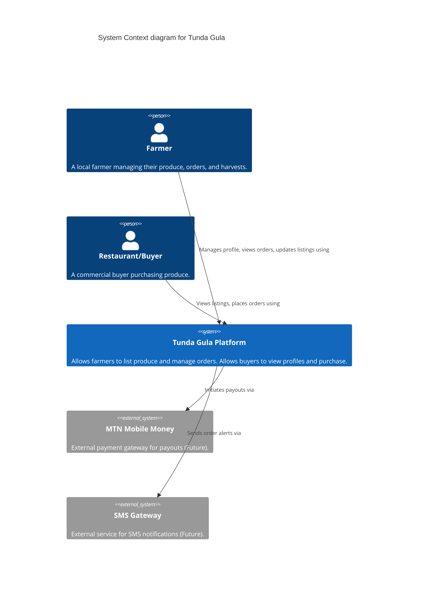
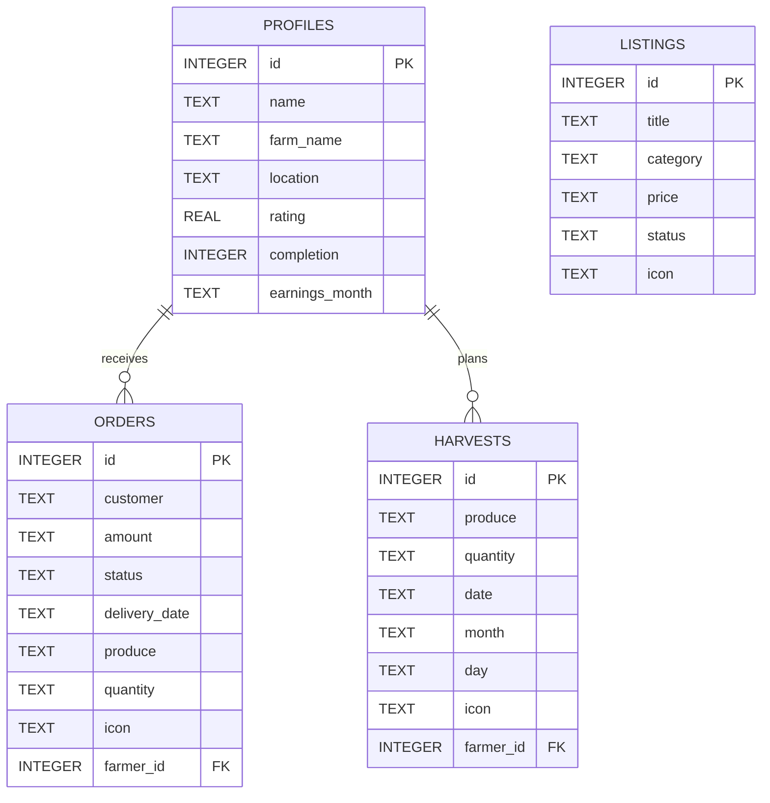
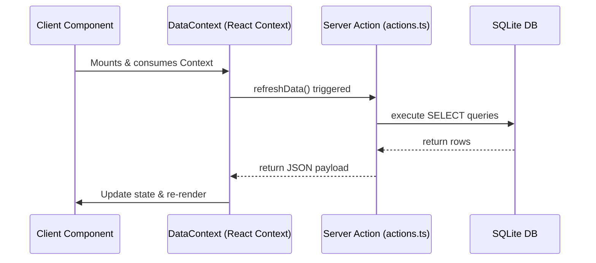
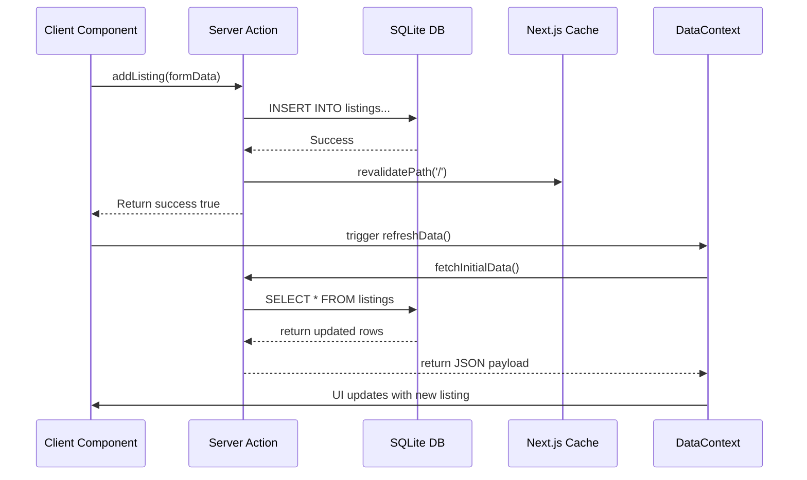

# Tunda Gula - Architecture Decision Document & System Architecture

> "Requirements drive architecture. Trade-offs inform decisions. ADRs capture rationale."

## 1. Executive Summary

This document outlines the architecture, data structures, operational procedures, and architectural decisions for the **Tunda Gula** dynamic prototype. The project has evolved from a static dashboard into a fully functional web application powered by **SQLite 3** and **Next.js Server Actions**. The goal is to provide a comprehensive, 400+ line breakdown of the architecture, trade-offs, schemas, and deployment strategies.

## 2. System Overview

Tunda Gula is a digital portal connecting farmers directly with restaurants and buyers. The platform provides a localized dashboard for farmers to manage their profiles, active listings, order history, and harvest schedules. 

### 2.1 Core Capabilities
- **Farmer Dashboard**: Real-time overview of farm metrics (earnings, profile completion, rating).
- **Listings Management**: CRUD operations for produce available for sale.
- **Order Tracking**: End-to-end tracking of customer requests and fulfillment.
- **Harvest Scheduling**: Predictive planning and calendar synchronization for future yields.
- **Public Profiles**: Public-facing storefronts for farmers.

### 2.2 System Architecture Diagram (C4 Context)



## 3. Technology Stack

The application employs a modern React-based stack optimized for simplicity and speed.

### 3.1 Frontend
- **Framework**: Next.js 15.1.7 (App Router)
- **Library**: React 19.0.0
- **Styling**: Vanilla CSS (Tailwind-inspired utility classes mapped in `index.css`)
- **Icons**: Lucide React
- **State Management**: React Context API (`DataContext.jsx`)

### 3.2 Backend
- **Architecture**: Next.js Server Actions (No traditional REST endpoints)
- **Database**: SQLite 3 (using `sqlite` and `sqlite3` packages)
- **Runtime**: Node.js

### 3.3 Tooling
- **Language**: TypeScript (Strict mode enabled)
- **Linting**: ESLint with Next.js configurations

## 4. Architectural Principles

**"Simplicity is the ultimate sophistication."**

1. **Minimize Moving Parts**: By using SQLite and Next.js, we eliminate the need for an external database server and a separate backend API server.
2. **Server Actions for Mutations**: All database writes occur via Server Actions, ensuring secure server-side execution without exposing API routes.
3. **Optimistic UI Updates**: The frontend should immediately reflect changes, relying on the Context API to sync state with the backend.
4. **Progressive Enhancement**: Start with a monolithic local SQLite database; migrate to PostgreSQL (e.g., Turso or Neon) only when horizontal scaling demands it.

## 5. Database Architecture

The data layer is a local SQLite database (`database.db`) operating in WAL (Write-Ahead Logging) mode for improved concurrency.

### 5.1 Entity Relationship Diagram (ERD)



### 5.2 Schema Definitions (Raw SQL)

#### Profiles Table
Stores the farmer's identity and farm-wide metrics.
```sql
CREATE TABLE IF NOT EXISTS profiles (
    id INTEGER PRIMARY KEY AUTOINCREMENT,
    name TEXT DEFAULT 'Emmanuel',
    farm_name TEXT DEFAULT 'AgriConnect Farm',
    location TEXT DEFAULT 'Kayunga',
    rating REAL DEFAULT 4.8,
    completion INTEGER DEFAULT 72,
    earnings_month TEXT DEFAULT 'UGX 842K'
);
```

#### Listings Table
Stores produce available for sale.
```sql
CREATE TABLE IF NOT EXISTS listings (
    id INTEGER PRIMARY KEY AUTOINCREMENT,
    title TEXT NOT NULL,
    category TEXT,
    price TEXT,
    status TEXT DEFAULT 'Active',
    icon TEXT DEFAULT '🥬'
);
```

#### Orders Table
Tracks customer requests and fulfillment status.
```sql
CREATE TABLE IF NOT EXISTS orders (
    id INTEGER PRIMARY KEY AUTOINCREMENT,
    customer TEXT NOT NULL,
    amount TEXT,
    status TEXT,
    delivery_date TEXT,
    produce TEXT,
    quantity TEXT,
    icon TEXT DEFAULT '🍽️'
);
```

#### Harvests Table
Manages the upcoming harvest calendar.
```sql
CREATE TABLE IF NOT EXISTS harvests (
    id INTEGER PRIMARY KEY AUTOINCREMENT,
    produce TEXT NOT NULL,
    quantity TEXT,
    date TEXT,
    month TEXT,
    day TEXT,
    icon TEXT DEFAULT '🍍'
);
```

## 6. Data Flow & State Management

Tunda Gula utilizes a hybrid state management approach combining Next.js Server Actions with the React Context API.

### 6.1 The "Read" Flow (Data Hydration)



1. **Initial Mount**: Client components wrapped in the `DataProvider` render.
2. **Action Invocation**: The `DataProvider` calls a server action (`fetchInitialData`).
3. **Database Execution**: The server action connects to SQLite via `src/lib/db.ts` and fetches data.
4. **State Update**: The returned JSON populates the global Context state.

### 6.2 The "Write" Flow (Mutations)



## 7. Next.js Routing Architecture

The application uses the App Router (`src/app`) for organizing routes logically.

### 7.1 Route Groups
- `(dashboard)`: Contains all routes related to the authenticated farmer dashboard. Shares a common `layout.tsx` featuring the `Sidebar` and `Topbar`.
- `(public)`: Public-facing routes (e.g., storefront, marketing pages).
- `admin`: Dedicated routes for system administrators.
- `registration`: The onboarding flow for new farmers.

### 7.2 Component Hierarchy
```text
src/
├── app/
│   ├── (dashboard)/
│   │   ├── page.tsx (Dashboard Home)
│   │   ├── listings/page.tsx
│   │   └── orders/page.tsx
│   ├── actions.ts (Server Actions)
│   └── layout.tsx (Root Layout)
├── components/
│   ├── Sidebar.tsx
│   ├── Topbar.tsx
│   └── Icons.tsx
└── lib/
    ├── db.ts (SQLite Connection wrapper)
    └── data.ts (Utility functions)
```

## 8. Security Architecture

### 8.1 SQL Injection Prevention
All database queries must use parameterized inputs to prevent SQL injection.
**Anti-Pattern:**
```javascript
// DANGEROUS: Susceptible to SQL injection
db.exec(`INSERT INTO listings (title) VALUES ('${userInput}')`);
```
**Correct Pattern:**
```javascript
// SECURE: Parameterized query
db.run(`INSERT INTO listings (title) VALUES (?)`, [userInput]);
```

### 8.2 Server Action Security
Server actions are strictly validated. Authentication checks (once implemented) will occur at the top of every exported server action function to prevent unauthorized writes.

## 9. Architecture Decision Records (ADRs)

### ADR 1: SQLite for Persistence
**Status:** Accepted
**Context:** The application needs a persistence layer that is easy to set up, requires zero configuration, and can run locally without external dependencies.
**Decision:** We will use SQLite 3 stored locally in the filesystem (`database.db`).
**Trade-offs:** 
- *Pros*: Zero config, extremely fast read times, no network latency, perfect for prototyping.
- *Cons*: Cannot be deployed to serverless environments (like Vercel) without losing data on every redeploy. Will require a VPS (like Render, DigitalOcean, or a dedicated instance) for production deployment.

### ADR 2: Vanilla CSS over Tailwind CSS
**Status:** Accepted
**Context:** The team wants precise control over the styling and a unified design system that doesn't rely on massive utility classes in the HTML.
**Decision:** Use a centralized `index.css` with semantic class names, while borrowing Tailwind's spacing and color scale conventions.
**Trade-offs:**
- *Pros*: Cleaner JSX, smaller bundle size, highly customized aesthetic.
- *Cons*: Slower development speed compared to raw Tailwind, requires manual CSS management.

### ADR 3: Server Actions over API Routes
**Status:** Accepted
**Context:** Next.js provides both API Routes (`/api/*`) and Server Actions for backend logic.
**Decision:** Use Server Actions exclusively for data mutations.
**Trade-offs:**
- *Pros*: Reduces boilerplate, allows direct execution of server code from client components, built-in types.
- *Cons*: Tightly couples the frontend and backend, making it difficult to expose a public REST API for mobile apps in the future without refactoring.

## 10. Future Architecture: Phase 5 (Dynamic Expansion)

To transition from a prototype to a scalable enterprise product, the architecture will evolve in Phase 5.

### 10.1 Dynamic Notification System
- **Database Addition**: `notifications` table (`id`, `message`, `type`, `is_read`, `created_at`).
- **Trigger Mechanism**: Server actions will fire dual inserts (e.g., when an order is created, a notification is also inserted).

### 10.2 Financial Ledger
- **Database Addition**: `transactions` table to create an immutable ledger of all earnings and payouts.
- **Query Optimization**: Using `SUM(amount) WHERE status = 'Completed'` to calculate wallet balances dynamically.

### 10.3 Horizontal Scaling Migration
When local SQLite becomes a bottleneck or serverless deployment is required:
1. Migrate `database.db` to **Turso** (LibSQL), which provides a SQLite-compatible edge database.
2. Update the `src/lib/db.ts` wrapper to use `@libsql/client`.
3. No SQL query changes will be required due to SQL compatibility.

## 11. Maintenance and Operations Playbook

### 11.1 Database Backups
Since SQLite is a single file, backups are trivial:
```bash
cp database.db backups/database_$(date +%Y%m%d).db
```

### 11.2 Database Migrations
For structural changes, manual migrations are currently used:
1. Create a migration script `migrate.js`.
2. Connect to the SQLite database.
3. Run `ALTER TABLE` or `CREATE TABLE` commands.
4. Execute via `node migrate.js`.

### 11.3 Performance Tuning
SQLite is configured with WAL (Write-Ahead Logging) to allow concurrent reads while writing.
```sql
PRAGMA journal_mode = WAL;
PRAGMA synchronous = NORMAL;
```

## 12. Component Design Principles

Components in Tunda Gula follow the **Smart/Dumb Component Pattern**.
- **Smart Components (Pages)**: Responsible for invoking Server Actions and mapping Context data. Located in `src/app`.
- **Dumb Components (UI)**: Pure presentational components receiving data via props. Located in `src/components`.

Example: The `Sidebar.tsx` simply consumes `user.farm_name` from Context and renders it, it does not fetch the profile data itself.

## 13. Deployment Architecture

For the current SQLite architecture, deployment requires a stateful persistent environment.

### Target Infrastructure: Node.js VPS / Docker
1. **Containerization**: A `Dockerfile` will package the Next.js app and the SQLite binary.
2. **Volume Mounts**: The `/app/database.db` file must be mounted to a persistent Docker volume to survive container restarts.
3. **Proxy**: Nginx or Caddy will act as a reverse proxy to serve the Node.js application running on port 3000.

**Invalid Deployment Targets:**
- Vercel (Serverless functions spin down, wiping local files).
- Netlify (Same limitation).

## 14. Code Quality & Linting

The project enforces strict TypeScript typing.
- All database rows must be cast to appropriate TypeScript interfaces immediately upon retrieval.
- ESLint is configured to catch exhaustive dependency arrays in `useEffect` and unused variables.

```typescript
// Example Interface Mapping
export interface Order {
  id: number;
  customer: string;
  amount: string;
  status: 'Pending' | 'Completed' | 'Cancelled';
}
```

## 15. Conclusion

The Tunda Gula architecture intentionally prioritizes development speed, operational simplicity, and direct database access for the prototyping phase. By utilizing SQLite and Server Actions, the system achieves a tight frontend-backend integration with minimal overhead. As the platform matures, the architecture is designed to gracefully pivot to distributed edge databases (like Turso) without requiring a massive rewrite of the data access layer.

---
*End of Document. Maintained by the Tunda Gula Engineering Team.*
